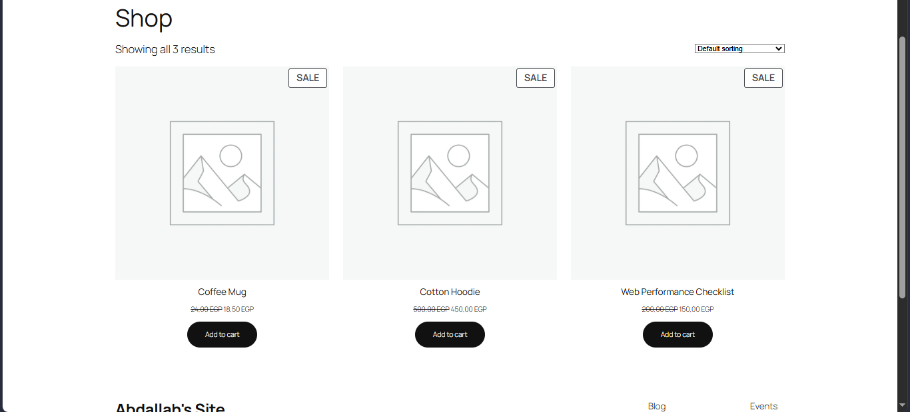
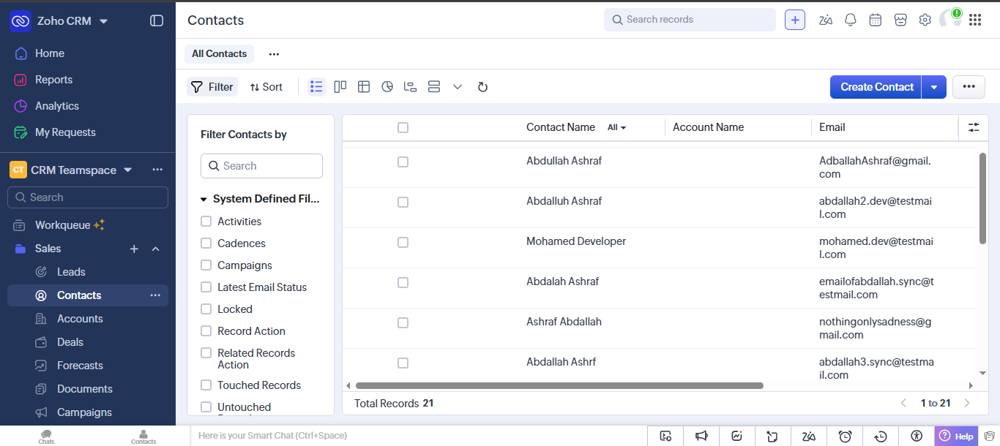
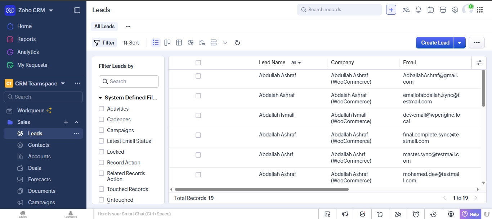
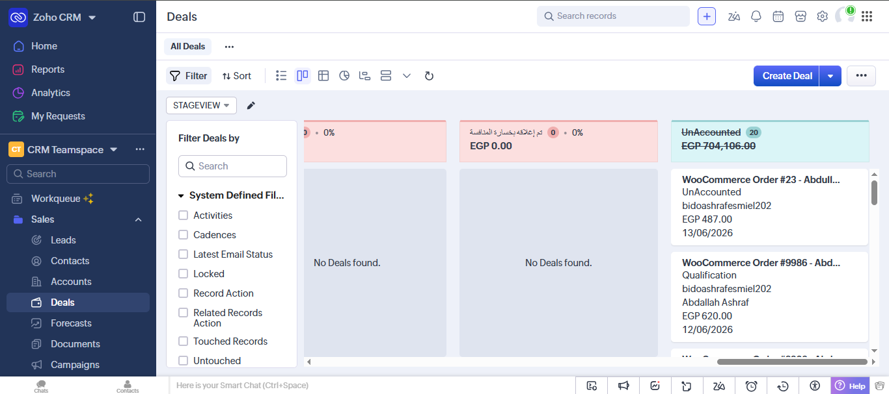

# WooCommerce to Zoho CRM Integration

A local integration solution that automatically synchronizes WooCommerce order events to Zoho CRM in real time using Zoho's Deluge scripting language. When a customer places an order on WooCommerce, this integration instantly captures the customer and transaction details to create or update a **Contact**, a **Lead**, and a **Deal** in Zoho CRM.



---

## 📌 Architecture Overview

The integration uses a push-based model triggered by WooCommerce Webhooks:

```
┌──────────────────────────┐                    ┌──────────────────────────┐
│   WooCommerce Store      │                    │        Zoho CRM          │
│   (LocalWP Environment)  │                    │         (Cloud)          │
│                          │                    │                          │
│  [Customer Places Order] │                    │                          │
│            │             │                    │                          │
│            ▼             │    HTTP POST       │                          │
│     WooCommerce Webhook  ├───────────────────►│   Exposed Deluge Function│
│   (Order Created Event)  │   (JSON Payload)   │   (Webhook Listener)     │
│                          │                    │            │             │
└──────────────────────────┘                    │            ▼             │
                                                │  1. Contact Sync (Map)   │
                                                │  2. Lead Sync (Map)      │
                                                │  3. Deal & Contact Link  │
                                                └──────────────────────────┘
```

1. **Trigger**: A customer completes a checkout on the local WooCommerce store.
2. **Payload**: WooCommerce triggers an `order.created` webhook event and sends a JSON payload containing order details (billing, products, totals) to Zoho CRM.
3. **Execution**: A Zoho CRM custom Deluge function (exposed as a REST API endpoint) parses the incoming payload.
4. **Data Sync**:
   * **Contact Module**: Verifies if the contact exists using email deduplication; creates or updates the Contact.
   * **Lead Module**: Creates or updates a Lead with WooCommerce affiliation and total revenue mappings.
   * **Deal Module**: Creates a Deal representing the order, captures line items, and links the Deal to the Contact.

---

## 🛠️ Prerequisites

* **WordPress & WooCommerce**: Set up locally using [LocalWP](https://localwp.com/).
* **Zoho CRM Account**: Developer Space (Functions) access.
* **Sample Data**: Configured product catalog and test orders for debugging.

---

## 🚀 Step-by-Step Setup Guide

### Step 1: Create the Zoho CRM Function

1. Log in to your **Zoho CRM** account.
2. Go to **Setup** (Gear Icon) > **Developer Space** > **Functions**.
3. Click **+ New Function** and configure:
   * **Function Name**: `woocommerce_order_sync`
   * **Display Name**: `WooCommerce Order Sync`
   * **Category**: `Standalone`
4. Paste the code from `src/woocommerce_order_sync.dg` into the editor and click **Save**.
5. Click **REST API** at the top right of the editor.
6. Enable the **REST API** toggle and copy the generated **API Endpoint URL**.

### Step 2: Configure WooCommerce Webhook

1. Go to your local WordPress Admin Dashboard.
2. Navigate to **WooCommerce** > **Settings** > **Advanced** > **Webhooks**.
3. Click **Add Webhook** and fill out the fields:
   * **Name**: Zoho CRM Order Sync
   * **Status**: `Active`
   * **Topic**: `Order created`
   * **Delivery URL**: Paste the Zoho CRM API Endpoint URL copied in Step 1.
   * **API Version**: `WP REST API Integration v3`
4. Click **Save Webhook**.

---

## 🔍 Code Walkthrough & Features

The Deluge script handles parsing, data structuring, and cross-linking without external dependencies:

### 1. Robust Contact ID Extraction
The script safely isolates the primary ID map block and provides a conditional fallback string parser to prevent runtime exceptions:
```deluge
contactId = "";
if(createContactResponse.get("code") == "SUCCESS" || createContactResponse.get("code") == "success" || createContactResponse.get("code") == "DUPLICATE_DATA")
{
    detailsObj = createContactResponse.get("details");
    if(detailsObj != null)
    {
        if(detailsObj.toString().startsWith("["))
        {
            contactId = detailsObj.get(0).get("id");
        }
        else
        {
            contactId = detailsObj.get("id");
        }
    }
}
```

### 2. Product Aggregation Loop
Line items are safely cast into a map array, iterated over, and concatenated into a description layout to maintain order details:
```deluge
for each item in lineItemsList
{
    itemMap = item.toMap();
    productName = itemMap.get("name");
    productQty = itemMap.get("quantity");
    
    productsText = productsText + productName + " (Qty: " + productQty + "), ";
}
```

### 3. Relational Cross-Linking Object
To associate the Deal directly with the customer card, the script embeds the extracted ID into a relational lookup map structure accepted by the Deals API module:
```deluge
if(contactId != "")
{
    contactLookupObject = Map();
    contactLookupObject.put("id", contactId);
    dealData.put("Contact_Name", contactLookupObject);
}
```

---

## 🧪 Testing & Verification

1. Place a test order on your local shop.
2. In Zoho CRM, open **Setup** > **Developer Space** > **Functions** > `woocommerce_order_sync` and look at Timeline/Execution Logs to verify execution status.
3. Check the respective CRM modules:

### Contacts Dashboard
Verify the entry profile contains the customer's identity:


### Leads Dashboard
Verify a record exists displaying the order value mapped into `Annual_Revenue`:


### Deals Dashboard
Verify the newly generated Deal contains the aggregated product description and holds a live link back to the parent Contact:


---

## 📄 License
This project is licensed under the MIT License - see the [LICENSE](LICENSE) file for details.
